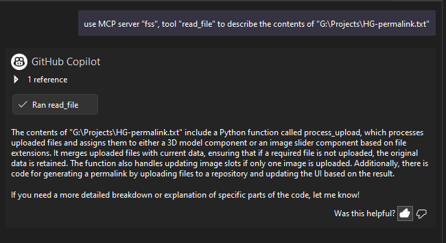

# FileSystem MCP Server

<!-- mcp-name: io.github.oncorporation/filesystem-server -->

Local MCP server for Visual Studio 2022+ that provides code-workspace functionality by giving AI agents selective access to project folders and files

## Table of Contents

- [🎯 Target Environment](#-target-environment)
- [Features](#features)
- [Installation](#installation)
- [Quick Start](#quick-start)
- [Configuration Options](#configuration-options)
  - [Option 1: Config.json File (Simplest - Recommended for Beginners)](#option-1-configjson-file-simplest---recommended-for-beginners)
  - [Option 2: Command-Line Arguments (Advanced - For MCP Clients)](#option-2-command-line-arguments-advanced---for-mcp-clients)
  - [Option 3: Hybrid Approach (Best of Both Worlds)](#option-3-hybrid-approach-best-of-both-worlds)
- [Usage](#usage)
  - [Command Line Examples](#command-line-examples)
  - [Available Tools](#available-tools)
- [Why This Hybrid Approach is Perfect](#why-this-hybrid-approach-is-perfect)
- [Visual Studio 2022+ Debugging](#visual-studio-2022-debugging)
- [Visual Studio 2022+ Usage Examples](#visual-studio-2022-usage-examples)
- [Editing Your mcp.json File via GitHub Copilot Chat](#editing-your-mcpjson-file-via-github-copilot-chat)
- [Security](#security)
- [Error Handling](#error-handling)
- [Troubleshooting](#troubleshooting)
  - [MCP Configuration Issues](#mcp-configuration-issues)
  - [Visual Studio 2022+ Debugging](#visual-studio-2022-debugging-1)
  - [Common Issues](#common-issues)
- [Command Line Reference](#command-line-reference)
- [Cross-Platform Path Support](#cross-platform-path-support)
- [Advanced & Real-World MCP Configuration Examples](#advanced--real-world-mcp-configuration-examples)

---

## 🎯 Target Environment

This MCP server is optimized for:
- **Visual Studio 2022+** development workflows
- **Local development environments** without complex workspace setups
- **Direct folder access** scenarios where you need filesystem operations
- **Development environments that don't use `.code-workspace` files**
- **Individual project directories** rather than multi-root workspaces

## Features

- **Directory Traversal**: List contents of allowed directories
- **File Reading**: Read contents of files with allowed extensions  
- **Directory Validation**: Check accessibility of configured directories
- **Hybrid Configuration**: Command-line arguments (MCP) + config.json fallback (debugging)
- **Visual Studio 2022+ Debugging**: No-argument startup support
- **Cross-Platform Path Support**: Automatically handles both Windows (`\`) and Unix (`/`) path separators
- **Security**: Access restricted to explicitly specified directories and file types
- **Local Development Focus**: Perfect for Visual Studio 2022+ and similar environments

## Installation

### From PyPI (Recommended for Users)

```bash
pip install vs-filesystem-mcp-server
```

### From Source (For Development)

1. Ensure you have **Python 3.10+** installed
2. Clone the repository
3. Navigate to the project directory
4. Install dependencies using uv:
   
   ```bash
   uv sync
   ```

## Quick Start

1. **For MCP usage**: Add the corrected configuration to your `.mcp.json`
2. **For debugging**: Just press F5 in Visual Studio 2022+ - uses config.json automatically
3. **Test your configuration** by calling the `init()` tool first
4. **If init() returns errors**, check your directory paths and permissions

## Configuration Options

### Option 1: Config.json File (Simplest - Recommended for Beginners)

**The easiest way to get started!** Create a `config.json` file:

**For MCP server usage:**
- Place `config.json` in the same folder as your `.mcp.json` file (usually `C:\Users\YourUsername\`)

**For debugging from source (Visual Studio 2022+):**
- Place `config.json` in the same directory as `app.py` (`D:/Projects/filesystem_server/`)

```json
{
  "allowed_dirs": [
    "C:/Users/YourUsername/Documents/projects",
    "D:/projects",
    "D:/Webs"
  ],
  "allowed_extensions": [
    ".py", ".js", ".ts", ".json", ".md", ".txt",
    ".yml", ".yaml", ".toml", ".cfg", ".ini", ".cs",
    ".css", ".scss", ".htm", ".html", ".xml", ".xaml"
  ]
}
```

#### MCP Configuration (Installed via pip)

Add this to your `.mcp.json` file (usually `C:\Users\YourUsername\` in VS 2022+):

```json
{
  "servers": {
    "filesystem-server": {
      "command": "vs-filesystem-mcp-server"
    }
  }
}
```

**Note:** When installed via pip, the command is just `vs-filesystem-mcp-server` - no path to `app.py` needed!

#### MCP Configuration (Running from Source)

If you're developing and running from source code:

```json
{
  "servers": {
    "filesystem-server": {
      "command": "python",
      "args": [
        "/absolute/path/to/your/project/filesystem_server/app.py"
      ],
      "cwd": "/absolute/path/to/your/project/filesystem_server"
    }
  }
}
```

**Benefits:**
- ✅ **No command-line arguments needed**
- ✅ **Perfect for Visual Studio 2022 debugging** (just press F5)
- ✅ **Works with MCP clients when placed in correct location**
- ✅ **Easy to edit and modify**
- ✅ **Great for testing and development**

**Usage:**
```bash
# For debugging in Visual Studio 2022:
python app.py  # Uses config.json from same directory as app.py

# For MCP server usage:
# The MCP client automatically finds config.json in the .mcp.json directory
```

**Important Location Notes:**
- 🔧 **Debugging**: `config.json` goes next to `app.py`
- 🌐 **MCP Server**: `config.json` goes next to `.mcp.json` 
- 📁 **Different locations** for different use cases!

### Option 2: Command-Line Arguments (Advanced - For MCP Clients) 

Best for production MCP client configurations where you want everything in one place:

#### When Installed via pip

```json
{
  "servers": {
    "filesystem-server": {
      "command": "vs-filesystem-mcp-server",
      "args": [
        "--allowed-dirs", "D:/projects", "D:/Webs",
        "--allowed-extensions", ".py", ".js", ".ts", ".json", ".md", ".txt"
      ]
    }
  }
}
```

#### When Running from Source

```bash
python app.py --allowed-dirs "D:/projects" "D:/Webs" --allowed-extensions ".py" ".js" ".md"
```

**MCP Client Configuration (.mcp.json):**
```json
{
  "servers": {
    "filesystem-server": {
      "command": "python",
      "args": [
        "/absolute/path/to/your/project/filesystem_server/app.py",
        "--allowed-dirs", "D:/projects", "D:/Webs",
        "--allowed-extensions", ".py", ".js", ".ts", ".json", ".md", ".txt"
      ],
      "cwd": "/absolute/path/to/your/project/filesystem_server"
    }
  }
}
```

**Benefits:**
- ✅ **Self-contained configuration**
- ✅ **No external config files needed**
- ✅ **Version control friendly**
- ✅ **Explicit and visible in MCP setup**

### Option 3: Hybrid Approach (Best of Both Worlds)

The server automatically uses **command-line arguments first**, then **falls back to config.json** if no arguments provided.

**How it works:**
- **MCP clients**: Use command-line arguments (Option 2)
- **Visual Studio debugging**: Automatically uses config.json (Option 1)
- **Priority**: Command-line args override config.json when present

**Benefits:**
- ✅ **Works for both MCP clients and debugging**
- ✅ **No conflicts between different usage scenarios**
- ✅ **Flexible and developer-friendly**
- ✅ **Choose the best option for each situation**

## Usage

### Command Line Examples

```bash
# With command line arguments (MCP clients):
python app.py --allowed-dirs "D:/projects" "D:/Webs" --allowed-extensions ".py" ".js" ".md"

# Using config.json fallback (Visual Studio 2022+ debugging):
python app.py

# Show MCP configuration help:
python app.py --help-mcp
```

### Available Tools

1. `init(directory, file_path)` - Validates accessibility of configured directories and can optionally list a directory and/or read a file
   - `directory` (optional): Directory path to list contents (can be `None`)
   - `file_path` (optional): File path to read content (can be `None`)
   - Returns `{ "message": "OK", "isError": false, ... }` if all directories accessible
   - Returns error details if any directories are inaccessible
   - Shows configuration source (command-line args vs config file)
   - Use this to verify your configuration before using other tools

2. `list_directory(directory, report_progress=True, batch_size=100)` - Lists files and subdirectories in a given directory, with optional progress reporting
   - `directory`: The absolute or relative path to the directory (supports both / and \\ separators)
   - `report_progress` (optional): If True, returns progress information and batch details (default: True)
   - `batch_size` (optional): Number of items to process before reporting progress (default: 100)
   - Returns a list of file and directory names if `report_progress` is False
   - Returns a dictionary with contents, progress_info, total_items, and processing_time if `report_progress` is True
   - If an error occurs, returns a dictionary with `"error"` and `"error_message"` keys
   - No exceptions are raised - all errors are returned as part of the result

3. `read_file(file_path)` - Reads the content of a specified file as text
   - Returns the file content as a string (for text files only)
   - Not suitable for binary files (images, audio, etc.)

4. `read_file_binary(file_path)` - Reads the content of a specified file as base64-encoded binary
   - Returns `{ "content_base64": <base64 string>, "encoding": "base64", "error": False }` on success
   - Returns an error dict if the file is not allowed or not found
   - Suitable for images, audio, and other binary files

5. `list_resources(directory=None, report_progress=True, batch_size=100)` - Lists all resources (files and directories) in a directory (or all allowed directories) in MCP resource format
   - `directory` (optional): Directory to start from (defaults to all allowed_dirs)
   - `report_progress` (optional): If True, returns progress information and batches (default: True)
   - `batch_size` (optional): Number of resources per progress batch (default: 100)
   - Returns a list of resource objects if `report_progress` is False
   - Returns a dictionary with contents, progress_info, total_items, and processing_time if `report_progress` is True
   - Example resource object:
     ```json
     {
       "id": "D:/projects/example.txt",
       "type": "file",
       "name": "example.txt",
       "path": "D:/projects/example.txt",
       "metadata": {
         "size": 1234,
         "modified": "2025-08-18T12:34:56Z"
       },
       "actions": ["read", "read_binary"]
     }
     ```

6. `get_resource(path)` - Gets metadata and actions for a specific file or directory
   - `path`: Absolute or relative path to the resource
   - Returns a resource object (id, type, name, path, metadata, actions) or an error dict
   - For files, includes size and modified time; for directories, includes type and actions
   - Does not return file content

## Why This Hybrid Approach is Perfect

- ✅ **MCP clients**: Use efficient command-line arguments
- ✅ **Visual Studio 2022**: Zero-friction debugging with config.json fallback
- ✅ **No conflicts**: Priority system handles both scenarios gracefully
- ✅ **Developer-friendly**: Works however you want to run it
- ✅ **Best of both worlds**: MCP efficiency + debugging convenience

## Visual Studio 2022+ Debugging

**Perfect debugging experience:**
- ✅ No command-line arguments needed
- ✅ Just press F5 to start debugging
- ✅ Automatically uses config.json
- ✅ Set breakpoints and debug normally
- ✅ Full IntelliSense and debugging support

**Debugging setup:**
1. Open the project in Visual Studio 2022
2. Ensure `config.json` exists (already created for you)
3. Press F5 or Debug > Start Debugging
4. Server starts with your configured directories

## Visual Studio 2022+ Usage Examples

Below are step-by-step examples showing how to call the FileSystem MCP Server from within Visual Studio 2022. These screenshots demonstrate the process using the alias **"fss"** for the server, which is simply a shorter name for `"filesystem-server"`. You can customize this alias in your `.mcp.json` file—**the actual name is up to you**.

> **Note:** All images are located in the `images/` subfolder.

### Step 1: Calling the Server Tool


In this example, the MCP client is configured to use `"fss"` as the server name. This is just an alias for convenience.

### Step 2: Viewing the Server Response



The server responds with the results of your request, such as the output from the `read_file()` tool.

---

> **Note:**  
> - The `"fss"` alias is used here for brevity. You can use any name you prefer in your `.mcp.json` configuration.
> - To change the server name, simply update the key in your `.mcp.json` file from `"filesystem-server"` to any other name you like.

For more details on configuring your MCP client, see the [Configuration Options](#configuration-options) section above.

## Editing Your mcp.json File via GitHub Copilot Chat

You can easily edit your `mcp.json` configuration file directly from Visual Studio using the GitHub Copilot Chat interface. Follow these steps:

1. **Click the Tools icon** on the right side of Visual Studio, while in Agent mode.
2. **Click the arrow** next to any MCP server in the list.
3. **Choose Edit** – the `mcp.json` file will open for editing.


This allows you to quickly update your MCP server configuration without leaving the IDE.

## Security

- Only directories specified in `--allowed-dirs` or config.json can be accessed
- Only files with extensions in `--allowed-extensions` or config.json can be read
- All paths are validated before access
- The server runs with the permissions of the user account
- **Perfect for local development**: Secure access to your project directories

## Error Handling

The server provides detailed error messages for:
- Unauthorized directory access
- Invalid file paths
- Unsupported file extensions
- Missing configuration (shows helpful guidance for both MCP and debugging scenarios)
- Directory accessibility issues (via `init()` tool)

**New Error Handling for list_directory():**
- The `list_directory()` function now returns errors as part of the result list instead of raising exceptions
- Error format: `["error", "detailed_error_message"]`
- This makes it easier for MCP clients to handle errors gracefully without exception handling
- Successful calls return the normal list of directory contents

## Troubleshooting

### MCP Configuration Issues

Your original config had a **missing comma** after `"D:/Webs"`. The corrected version above fixes this.

### Visual Studio 2022+ Debugging

1. **Ensure config.json exists** (already created for your directories)
2. **Start with the `init()` tool** to validate your configuration
3. **Set breakpoints** and debug normally
4. **Check output window** for configuration source confirmation

### Common Issues

1. **Missing configuration**: The server shows helpful messages for both MCP and debugging scenarios
2. **Path access errors**: Verify your directories exist and are accessible
3. **Permission issues**: Check directory permissions on your configured paths
4. **MCP client issues**: Use the corrected configuration above

## Command Line Reference

```bash
python app.py --help                         # Show help
python app.py --help-mcp                     # Show MCP configuration examples  
python app.py --allowed-dirs DIR1 DIR2       # Set allowed directories
python app.py --allowed-extensions EXT1 EXT2 # Set allowed extensions
python app.py --config custom.json           # Use custom config file
python app.py                                # Use config.json fallback (debugging)
```

## Cross-Platform Path Support

The filesystem server automatically normalizes paths to handle different operating system conventions:

### ✅ **Windows Users - Both Formats Work**
```json
{
  "allowed_dirs": [
    "D:\\projects",           // Windows-style backslashes
    "F:/sd/wipes",           // Unix-style forward slashes  
    "C:\\Users\\Me\\Docs"    // Mixed formats work too
  ]
}
```

### ✅ **Automatic Path Normalization**
- **Input**: `"F:\sd\wipes"` (Windows natural format)
- **Normalized**: `"F:/sd/wipes"` (Python-friendly format)
- **Result**: ✅ Works seamlessly, no errors!

### ✅ **MCP Tool Examples**
```python
# All of these work identically:
list_directory("F:\\sd\\wipes")    # Windows format
list_directory("F:/sd/wipes")      # Unix format  
list_directory("F:\\sd/wipes")     # Mixed format
```

### **Why This Matters**
- 🪟 **Windows users** can naturally type `F:\sd\wipes`
- 🐧 **Unix users** can use traditional `F:/sd/wipes`
- 🔧 **No more path format errors** - everything just works
- 🛡️ **Security checks work correctly** regardless of separator style

## Advanced & Real-World MCP Configuration Examples

For more advanced, platform-specific, or legacy MCP client configuration examples (including both `"servers"` and `"mcpServers"` formats), see the [mcp_configuration_examples.json](./mcp_configuration_examples.json) file in this repository.

This file includes:
- Additional real-world setups for Windows, Linux, and macOS
- Minimal web development configurations
- Multiple directory and file type examples
- Migration tips for moving from config.json to command-line arguments
- Legacy MCP client support using the `"mcpServers"` format

Refer to it if you need more flexibility or are working with a non-standard MCP client.

<a href="https://www.buymeacoffee.com/Surn" target="_blank"></a>